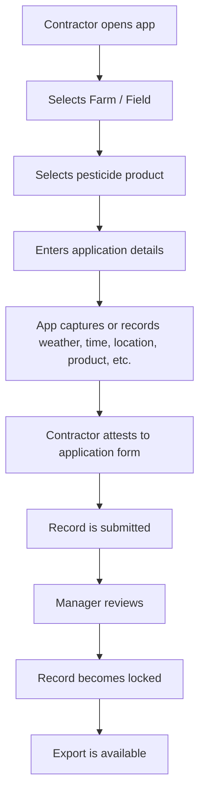
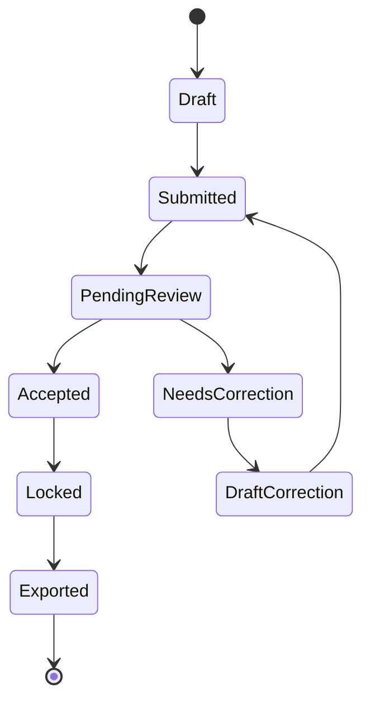
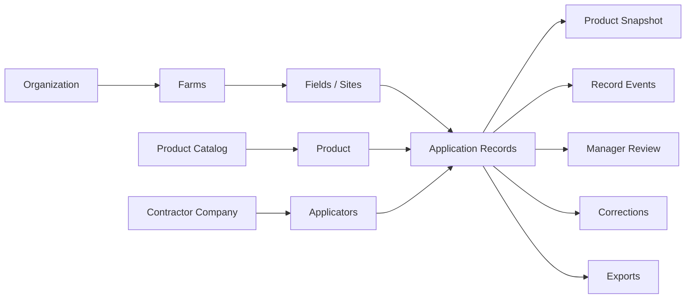
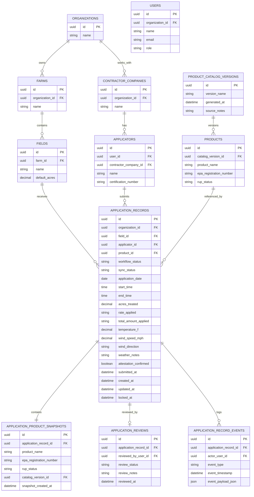

# FieldLog Reproducible Design Snapshot v0.1

Date: 2026-05-19  
Purpose: Preserve the current FieldLog design in a text-first, reproducible format that can be copied into another model, rendered in Markdown/Mermaid, or used as the basis for database design.

## 1. Product Frame

FieldLog is a mobile-first, offline-capable pesticide application recordkeeping app for agricultural operations.

The target customer is a mid-to-large agricultural operation that works with spray contractors or applicators. The core problem is that pesticide application records are scattered across texts, spreadsheets, paper notes, photos, weather apps, and memory.

FieldLog is not primarily a pesticide database app. It is an offline evidence-capture app for pesticide application records. The pesticide/RUP/product catalog is supporting reference data.

Core system framing:

```text
FieldLog = Application Record spine + offline capture + manager review + immutable evidence/export
```

## 2. Golden Happy Path



Core output:

```text
Golden Happy Path -> produces one Application Record
```

## 3. Application Record Sections

```text
Application Record
├── Applicator
├── Field / Site
├── Product
├── Application Details
├── Weather / Conditions
├── Attestation
├── Manager Review
├── System Audit Metadata
└── Evidence Attachments later, not MVP
```

Data ownership/source split:

```text
Contractor Inputs
├── Applicator
├── Field / Site
├── Product
├── Application Details
├── Weather / Conditions
└── Attestation

Manager Inputs
└── Manager Review

System-Captured Fields
└── System Audit Metadata
```

## 4. Contractor Form Field Map

### Applicator

| Field | Input Control | Source | Required Rule | Notes |
|---|---|---|---|---|
| Applicator Name | Autocomplete | Contractor input / known applicators | Required | Prefer selecting from known applicators. Manual entry acceptable for MVP. |
| Company | TextField or Autocomplete | Autofill from applicator if available | Optional | Editable in MVP. |
| Certification Number | TextField | Contractor input / autofill if profile known | Required if RUP = yes | Use later validation/formatting by state. |

### Field / Site

| Field | Input Control | Source | Required Rule | Notes |
|---|---|---|---|---|
| Farm | Autocomplete | Known farm list | Required | Select first; filters fields. |
| Field | Autocomplete | Known field list filtered by farm | Required | Field may later include geospatial boundary. |
| Crop or Site | Autocomplete | Crop/site list | Required | Allow non-crop site later. |
| Acres Treated | Numeric TextField | Contractor input | Required | Use decimal input, not slider. |

### Product

| Field | Input Control | Source | Required Rule | Notes |
|---|---|---|---|---|
| Product Name | Autocomplete/search | Local offline product catalog | Required | Use freeSolo only for “product not found” path. |
| EPA Registration Number | TextField | Autofill from product; editable if manual | Required unless product not found | Keep exact value used on submitted record. |
| RUP Status | Read-only Chip/Alert | Product catalog derived value | Required as yes/no/unknown | Do not use checkbox. User should not decide truth manually. |

RUP handling:

```text
RUP = yes
→ require certification number

RUP = no
→ normal flow

RUP = unknown
→ allow record creation
→ force manager review
→ mark record as compliance uncertainty
→ block automatic acceptance
```

### Application Details

| Field | Input Control | Source | Required Rule | Notes |
|---|---|---|---|---|
| Application Date | DatePicker | Contractor input, default today | Required | Store date explicitly. |
| Start Time | TimePicker | Contractor input | Required | Default to now only if acceptable. |
| End Time | TimePicker | Contractor input | Optional for MVP | Useful later for audit precision. |
| Application Method | Select | Contractor input | Required | Example options below. |
| Rate Applied | TextField for MVP | Contractor input | Required | Later split into amount/unit/basis. |
| Total Amount Applied | TextField for MVP | Contractor input | Required | Later compute from rate × acres when units are structured. |

Application method options for MVP:

```text
Ground sprayer
Aerial
Handheld / backpack
Boom sprayer
Spot treatment
Irrigation / chemigation
Other
```

### Weather / Conditions

| Field | Input Control | Source | Required Rule | Notes |
|---|---|---|---|---|
| Temperature | Numeric TextField | Manual for MVP; auto-capture later | Required | Store Fahrenheit for MVP. |
| Wind Speed | Numeric TextField | Manual for MVP; auto-capture later | Required | Store mph for MVP. |
| Wind Direction | Select | Contractor input | Required | Use compass directions. |
| Weather Notes | Multiline TextField | Contractor input | Optional | For contextual notes. |

Wind direction options:

```text
N
NE
E
SE
S
SW
W
NW
Variable
Calm
Unknown
```

### Attestation

| Field | Input Control | Source | Required Rule | Notes |
|---|---|---|---|---|
| Submitted By | Read-only text | Logged-in user | Auto | Do not let user freely edit. |
| Submitted At | Read-only timestamp | System timestamp | Auto on submit | Set when user submits. |
| Attestation Confirmed | Checkbox | Contractor input | Required | Explicit confirmation before submit. |

Suggested attestation label:

```text
I confirm that this application record is accurate to the best of my knowledge.
```

## 5. Manager Inputs

| Field | Input Control | Source | Required Rule | Notes |
|---|---|---|---|---|
| Review Status | Select | Manager input | Required when reviewed | Manager-only. |
| Reviewed By | Read-only text | Logged-in manager | Auto | Set from manager account. |
| Reviewed At | Read-only timestamp | System timestamp | Auto | Set when review action happens. |
| Review Notes | Multiline TextField | Manager input | Optional, required if rejected/correction requested | Supports manager decision record. |

Manager actions:

```text
Accept & Lock
Request Correction
Reject
```

## 6. System-Captured Fields

| Field | Input Control | Source | Notes |
|---|---|---|---|
| Created At | Read-only | System | Local creation timestamp. |
| Created Offline | Read-only boolean/chip | System | True if no server confirmation at creation. |
| Last Updated At | Read-only | System | Changes during draft edits. |
| Locked At | Read-only | System | Set when manager locks record. |
| Catalog Version | Read-only | System/product catalog | Product catalog version used. |

Important timestamp rule for offline-first:

```text
Store UTC timestamp
+ local timezone
+ device-created timestamp if offline
```

Example:

```json
{
  "applicationStartAt": "2026-05-18T14:30:00Z",
  "applicationTimezone": "America/Chicago",
  "createdOnDeviceAt": "2026-05-18T09:35:12-05:00"
}
```

## 7. Field Rules for Submit

Minimum submit rules:

```text
Applicator name required
Farm required
Field required
Crop or site required
Acres treated required
Product name required
EPA registration number required unless product not found
Application date required
Start time required
Application method required
Rate applied required
Total amount applied required
Temperature required
Wind speed required
Wind direction required
Attestation confirmation required
Certification number required if RUP status is yes
Manager review required if RUP status is unknown
```

Important:

```text
RUP unknown should not block record creation.
It should block automatic acceptance.
```

## 8. Application Record Lifecycle

Workflow Status is separate from Sync Status.



Workflow statuses:

```text
Draft
Submitted
Pending Review
Needs Correction
Accepted
Locked
Exported
```

Sync statuses:

```text
Local Only
Queued
Syncing
Synced
Sync Failed
```

Key lifecycle rules:

```text
Draft records can be edited.
Submitted records should not be silently edited.
Pending Review records are manager-reviewable.
Needs Correction creates a correction path; original submitted version should remain preserved.
Locked records are immutable.
Exported records have been included in a report/export package.
Workflow status and sync status must not be collapsed into one field.
```

Permission table:

| Status | Contractor Can Edit? | Manager Can Review? | Exportable? |
|---|---:|---:|---:|
| Draft | Yes | No | No |
| Submitted | No / limited | Yes | No |
| Pending Review | No | Yes | No |
| Needs Correction | Correction only | Yes | No |
| Accepted | No | Yes | Maybe |
| Locked | No | No normal edits | Yes |
| Exported | No | No | Yes |

## 9. Core Domain Model

```text
People / Access
├── User
├── Role
├── Applicator Profile
├── Manager Role
├── Contractor Company
└── Organization

Places
├── Farm
├── Field / Site
└── Treated Area

Products / Reference Data
├── Product Catalog
├── Product
├── EPA Registration Number
├── Product Snapshot
└── Catalog Version

Records
├── Application Record
├── Review
├── Correction
└── Export

Events
├── Created
├── Updated
├── Submitted
├── Synced
├── Accepted
├── Correction Requested
├── Locked
└── Exported
```

Important domain correction:

```text
User, Applicator, and Manager should not always be separate people.

User = login account
Applicator = role/profile used when applying pesticide
Manager = role/profile used when reviewing records

A user can have one or more roles.
```

## 10. Core Relationships



Relationship rules:

```text
Organization has many Farms
Farm has many Fields/Sites
Field/Site has many Application Records
Organization has many Contractor Companies
Contractor Company has many Applicators
Applicator submits many Application Records
Product Catalog has many Products
Product belongs to a Catalog Version
Application Record references a Product
Application Record contains a Product Snapshot
Application Record has many Events
Application Record may have one Manager Review
Application Record may have many Corrections
Application Record may be included in Exports
```

Important product/reference-data rule:

```text
Product is reference data and can change.
Product Snapshot is evidence copied into the Application Record at submission or lock time.
Product ≠ Product Snapshot.
```

Example:

```text
Current Product says RUP = No.
Old Product Snapshot at time of application says RUP = Yes.
The application record must preserve the old snapshot.
```

## 11. Database Tables v0.1 Candidate

Do not overbuild yet. The next task is to design these tables with primary keys, foreign keys, and essential columns.

Candidate tables:

```text
organizations
users
contractor_companies
applicators
farms
fields
product_catalog_versions
products
application_records
application_product_snapshots
application_reviews
application_record_events
```

Important foreign key arrows:

```text
organizations → farms
farms → fields
organizations → contractor_companies
contractor_companies → applicators
product_catalog_versions → products
fields → application_records
applicators → application_records
products → application_records
application_records → application_product_snapshots
application_records → application_reviews
application_records → application_record_events
```

Mermaid ERD draft:



## 12. Potential Problems Parked for Later

```text
Failed sync
Bad product
Stale catalog
Legal nuances
Contractor dispute
Correction workflow
```

Treat these as a parking lot, not current scope.

## 13. Next Task

Design Database Tables v0.1.

Instructions for next session:

```text
Start with table names, primary keys, foreign keys, and essential columns only.
Do not add attachments, exports, or correction tables unless needed for the minimum spine.
Focus only on whether one Application Record can be saved, submitted, reviewed, locked, and audited.
Proceed one layer at a time.
Challenge weak modeling choices.
Avoid information overload.
Keep the design centered on the Application Record spine.
```
